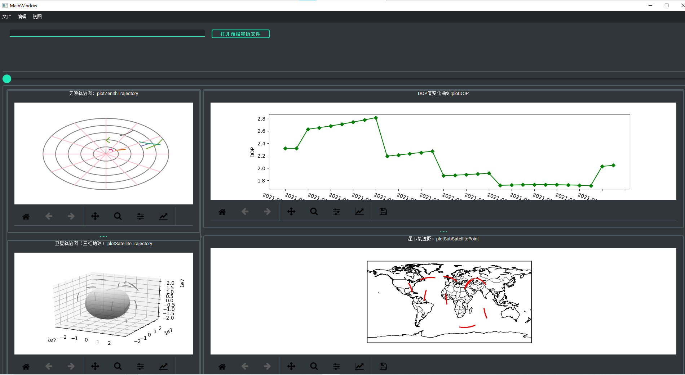

# GNSS卫星天顶位置

## 开源项目引用声明

https://github.com/medicinely/GNSS-SPP-positioning-practice
https://github.com/mutability/mlat-server

## DEFECT

- 仅支持GPS
- 支持的星历文件类型有限
- 星历数据需要配合观测文件以获取时间
- matplotlib navtool的高度有点高了
- 构图好难看

## DONE

~ 20220719 :

~ alpha v0.0.1

- 界面初始化
- 界面绘图区动态拉伸：Qsplitter
- 读入默认星历数据（目前仍需要）
- 使用静态数据绘制三维地球卫星轨迹图（时间段）
- pyinstaller打包

---

~20220720:

- 使用静态数据绘制星下点轨迹图（时间段）
- 使用静态数据绘制天顶图（时间段）

- 实现DOP值计算测试
- 使用静态数据计算DOP变化（时间段）

## TODO

功能性：

**priority（High to Low）**

- 把位置数据计算抽出来放一个class里
- 卫星坐标数据用pandas管理

- 提供观测点坐标输入功能（目前是写死的）
  - 静态坐标点输入
  - 地图坐标点选择
  - （**Low priority**） 全球大城市坐标选择/中国所有城市坐标
- 观测时间段可重绘：选择起始结束时间重绘四图
- 动态星历数据读入功能

**不区分优先级**

- 多星座
- 数据下载
- 本地数据导入

项目性：

- 需要加 requirements.txt文件

## 备注

本地打包命令

`.\SatPackEnv\Scripts\active`

 `pyinstaller -p .\SatPackEnv\Scripts\  -onefile .\SatPosition.py`